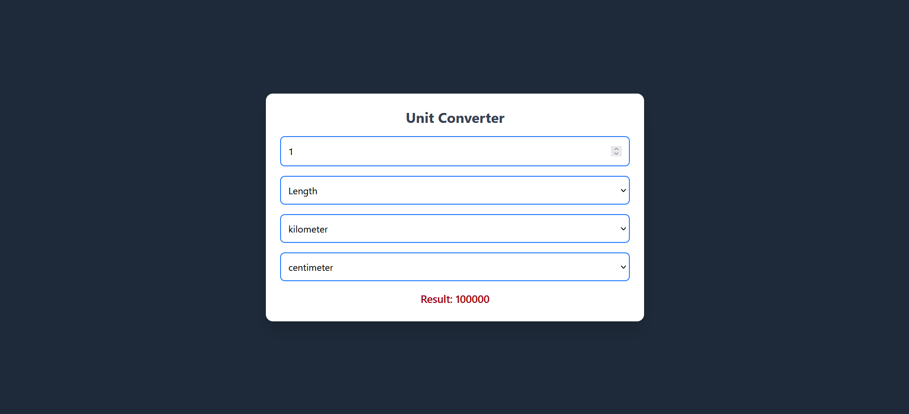

**Project URL:** - https://roadmap.sh/projects/unit-converter

## Unit Converter

# Unit Converter (Angular + Django)

A full-stack Unit Converter web application built using Angular for the frontend and Django REST Framework for the backend.
The application allows users to convert values across multiple categories such as length, weight, and temperature in real time.

---

## Features

* Convert between multiple unit categories:

  * Length (meter, kilometer, mile, etc.)
  * Weight (gram, kilogram, pound, etc.)
  * Temperature (celsius, fahrenheit, kelvin)

* Real-time conversion using API calls

* Dynamic dropdowns based on selected category

* Responsive UI built with Tailwind CSS

* Two-way data binding using Angular

* REST API built with Django

---

## Tech Stack

### Frontend

* Angular
* Tailwind CSS
* TypeScript

### Backend

* Django
* Django REST Framework

---

## Project Structure

```
unit-converter/
│
├── backend/        # Django project
│   ├── api/
│   ├── manage.py
│
├── frontend/       # Angular project
│   ├── src/
│   ├── angular.json
│
└── README.md
```

---

## Setup Instructions

### 1. Clone the Repository

```
git clone <https://github.com/Priyanshu-Bhatt09/Unit-Converter>
cd Unit-Converter
```

---

## Backend Setup (Django)

### Step 1: Navigate to backend

```
cd backend
```

### Step 2: Create virtual environment

```
python -m venv venv
```

### Step 3: Activate virtual environment

Windows:

```
venv\Scripts\activate
```

Mac/Linux:

```
source venv/bin/activate
```

### Step 4: Install dependencies

```
pip install django djangorestframework django-cors-headers
```

### Step 5: Apply migrations

```
python manage.py migrate
```

### Step 6: Run server

```
python manage.py runserver
```

Backend runs at:

```
http://127.0.0.1:8000/
```

---

## Frontend Setup (Angular)

### Step 1: Navigate to frontend

```
cd frontend
```

### Step 2: Install dependencies

```
npm install
```

### Step 3: Run Angular app

```
ng serve
```

Frontend runs at:

```
http://localhost:4200/
```

---

## API Endpoint

```
POST /api/convert/
```

### Sample Request

```
{
  "value": 10,
  "from_unit": "meter",
  "to_unit": "kilometer",
  "category": "length"
}
```

### Sample Response

```
{
  "result": 0.01
}
```

---


